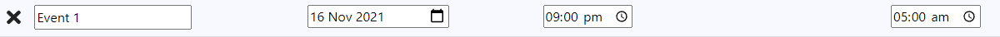
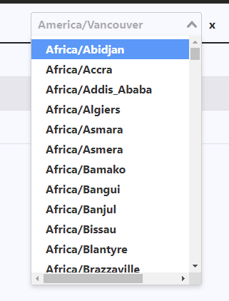

# Time Zone Converter
#### Video Demo:  https://youtu.be/QG41cRfyEzc
#### Interactive Demo: https://zanbato95.github.io/timezone-converter/


## Description:

> The Time Zone Converter is a simple and useful tool to convert your schedule to different time zones.

I started this project as a prerequisite in my online course of [CS50](https://www.edx.org/course/introduction-computer-science-harvardx-cs50x). It tells us to create any project that we see fit as long as we apply the lessons that we learned throughout the course. Since I'll be going in solo in this project, I wanted to try and build a simple yet useful program that I could imagine myself be using. And since I frequently watch live streams of various streamers and artist in diffrent parts of the world, the app idea that came in my head is a time zone converter.

I made the time zone converter in way where you could easily see and edit your intended date and time. Think of it like a spreadsheet. With each interaction and changes to it, the app itself will imediately give feedback to your changes. And unlike most time zone converter out there where you could only view a single time zone at a time, I made this app in a table format with multiple dates and multiple time zones you could choose from.

This is my first attempt in creating a small and working project and I hope you'll find my time zone converter helpful :)

### Built with
This app was built entirely using [Vue2](https://vuejs.org/) with it's primary package of use is [Moment JS](https://momentjs.com/). Using the Vue framework, I've been able to apply separate component functionality and make my application reactive to each input. 

## Project setup
```
npm install
```

### Compiles and hot-reloads for development
```
npm run serve
```

### Compiles and minifies for production
```
npm run build
```

### Lints and fixes files
```
npm run lint
```

### Customize configuration
See [Configuration Reference](https://cli.vuejs.org/config/).


## Usage
- We have an event row where you could put in the name of the event, the date and the time. 

    

- The 2 buttons here are for adding new events and also additional time zones.

    

- The time zones are drop down and you can search for the necessary city that you want.

    

- You can also change the time from different time zones and also remove events and timezones by pressing the ‘x’ button. 

